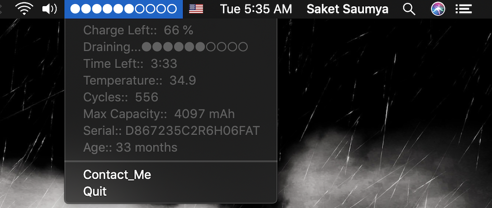

# iBatteryStats 🔋                                                

[](https://www.python.org/downloads/release/python-360/)

[](https://www.python.org/)
[](https://www.gnu.org/software/bash/)
[](https://github.com/saket13/iBatteryStats/blob/master/LICENSE)

I use MacOS X(10.14.5) Mojave and Apple removed the option to show the battery time remaining in the statusbar since the macOS X(10.12.2) release.**iBatteryStats** is a MacOSX menu bar app 👨🏻‍💻 built to keep an eye on *slowly dying macbook battery* . Dedicated to all Apple MacBook Users with ❤️. 

*****Find the Project's Github Link Here👇*****

[](https://github.com/saket13/iBatteryStats)

## Screenshots

**Charging & Discharging:**

|   |   |
|:---:|:---:|
| CHARGING | DISCHARGING |

**Low Battery Notification:**


## Design

This Apple Menu bar application has two parts 
- A **Bash script** that runs as a **cron job** and dumps battery stats to a log file, 
- A **Python script** that processes the log file to generate cumulative statistics like Charge Left, Status, Time Left, Cycles and Temperature etc & 
- Everything has been wrapped to a Status bar app using Rumps.

I've also modified the Python script that is being run to alert you (via **Rumps Desktop Notification Feature**) of 'Charge Your Mac' in the last 15 and 10 mins remaining.

## Package Structure
    
    iBatterstats.app.zip      # Root Package (ZIP Format)
    .
    ├── Contains              # For data handling.
    │   ├── Python Script     # Reads LOG file stats
    │   ├── BASH Script       # Dumps stats to LOG File     
    │   └── LOG File          # Contains all stats updated through crontab
    |
    └── IBatteryStats     
    
## Installation

Clone the repo and install Rumps

```bash
git clone https://github.com/saket13/iBatteryStats 
sudo chmod +x path_to_iBatteryStats/iBatteryStats/battery.sh
sudo -H pip3 install rumps

```

Add this line to your cron tab (`crontab -e`):

     SHELL= /bin/bash   
     */1 * * * * /bin/bash/ path_to_iBatteryStats/iBatteryStats/battery.sh > path_to_iBatteryStats/iBatteryStats/back.log 2>&1
     # Here in crontab entry 1st argument says script is called every minute and second argument specifies where the script is and third where the log file is 

Modify your python script to fetch values:

```python
#Enter the absolute address of the file here and leave everything as it is
log_file_path = 'path_to_iBatteryStats/iBatteryStats/back.log'

```

## Usage

You can simply do:

```python
nohup python3 path_to_iBatteryStats/iBatteryStats/battery.py &

```
or to open the Application with no opening of terminal and on a single click

```bash
#Modify the content of app_shell to ::

#!/bin/sh
nohup python3 path_to_iBatteryStats/iBatteryStats/battery.py &

# And give it full permission ::

sudo chmod +x path_to_iBatteryStats/iBatteryStats/app_shell

```     
    
## Future Ideas and TODOs

* Integrate other power management tools.

* Handle every second stats and update it .
    * For now it is working every minute.

* Make this, the data dumping cron job and a battery status menu bar app indicator all a part of a single big application?

## Contributing
Pull requests are welcome. For major changes, please open an issue first to discuss what you would like to change.

See [Contributing Guidelines](CONTRIBUTING.md). 

## Contact
If you need any help, you can connect with me.

Visit:- [saketsaumya.info](https://saketsaumya.info)

## License

```
MIT License

Copyright (c) 2020 Saket Saumya

Permission is hereby granted, free of charge, to any person obtaining a copy
of this software and associated documentation files (the "Software"), to deal
in the Software without restriction, including without limitation the rights
to use, copy, modify, merge, publish, distribute, sublicense, and/or sell
copies of the Software, and to permit persons to whom the Software is
furnished to do so, subject to the following conditions:

The above copyright notice and this permission notice shall be included in all
copies or substantial portions of the Software.

THE SOFTWARE IS PROVIDED "AS IS", WITHOUT WARRANTY OF ANY KIND, EXPRESS OR
IMPLIED, INCLUDING BUT NOT LIMITED TO THE WARRANTIES OF MERCHANTABILITY,
FITNESS FOR A PARTICULAR PURPOSE AND NONINFRINGEMENT. IN NO EVENT SHALL THE
AUTHORS OR COPYRIGHT HOLDERS BE LIABLE FOR ANY CLAIM, DAMAGES OR OTHER
LIABILITY, WHETHER IN AN ACTION OF CONTRACT, TORT OR OTHERWISE, ARISING FROM,
OUT OF OR IN CONNECTION WITH THE SOFTWARE OR THE USE OR OTHER DEALINGS IN THE
SOFTWARE.
```
